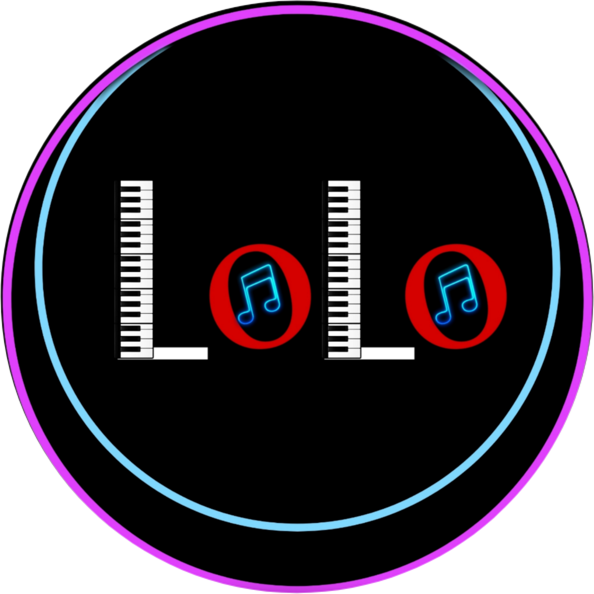

# LOLO SYNC

**LOLO SYNC** is the live lyrics display for SRKR LOLO.

One person controls the show from the admin console, and every audience screen follows instantly:

- **Audience screen** (`/`): shows the current song with lyrics.
- **Admin console** (`/admin`): manage songs, events, and push songs live.

Live site: https://lyrics.srkrlolo.in

## Run it

```bash
npm install
npm run dev
```

Needs a `.env` file with:

```env
VITE_SUPABASE_URL=https://<project>.supabase.co
VITE_SUPABASE_PUBLISHABLE_KEY=<key>
```

Other commands: `npm run build`, `npm run preview`, `npm run lint`.

## Stack

React + TypeScript + Vite + Tailwind + Supabase. Deployed on Vercel.
